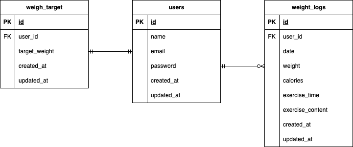

# test3_PiGLy

##　環境構築

### Dockerビルド
1. プロジェクトのルートディレクトリに移動し、以下のコマンドでクローンします</br>
HTTP形式：
`git clone https://github.com/yurikoUe/test3_PiGLy.git`  
SSH形式：
`git clone git@github.com:yurikoUe/test3_PiGLy.git`

2. `docker-compose up -d --build`
>MacのM1・M2チップのPCの場合、`no matching manifest for linux/arm64/v8 in the manifest list entries`のメッセージが表示され、ビルドができないことがあります。エラーが発生した場合は、docker-compose.ymlファイルの「mysql」の記述箇所に、platformの項目を追加で記載し、もう一度ビルドしてください。
```
mysql:
    platform: linux/x86_64（この分を追加）
    image: mysql:8.0.26
    environment:
```
3. DockerDesktopアプリでコンテナが起動していることを確認してください

### Laravel環境構築
1. `docker-compose exec php bash`
2. `composer install`
3. 「.env.example」ファイルを「.env」ファイルに命名変更するか、以下のコマンドで「.env.example」をコピーして「.env」を作成。

`cp .env.example .env`

4. .envファイル内のDBの箇所を以下のように変更
```
DB_CONNECTION=mysql
DB_HOST=mysql
DB_PORT=3306
DB_DATABASE=laravel_db
DB_USERNAME=laravel_user
DB_PASSWORD=laravel_pass
```

5. アプリケーションキーの作成をします

`php artisan key:generate`

6. シンボリックリンクの作成をします

`php artisan storage:link`

7. マイグレーションの実行をします

`php artisan migrate`

8. シーディングの実行

`php artisan db:seed`


## 使用技術
- **Laravel**: 8.75
- **Docker**: 最新版
- **MySQL**: 8.0.26
- **PHP**: 7.4.9
- **Nginx**: 1.21.1
- **phpMyAdmin**

## ER図

以下は、プロジェクトのER図です。




## URL
+ 開発環境：http://localhost/
+ phpMyAdmin:：http://localhost:8080/